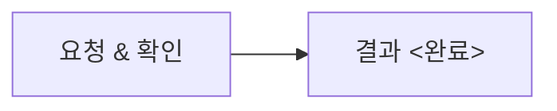
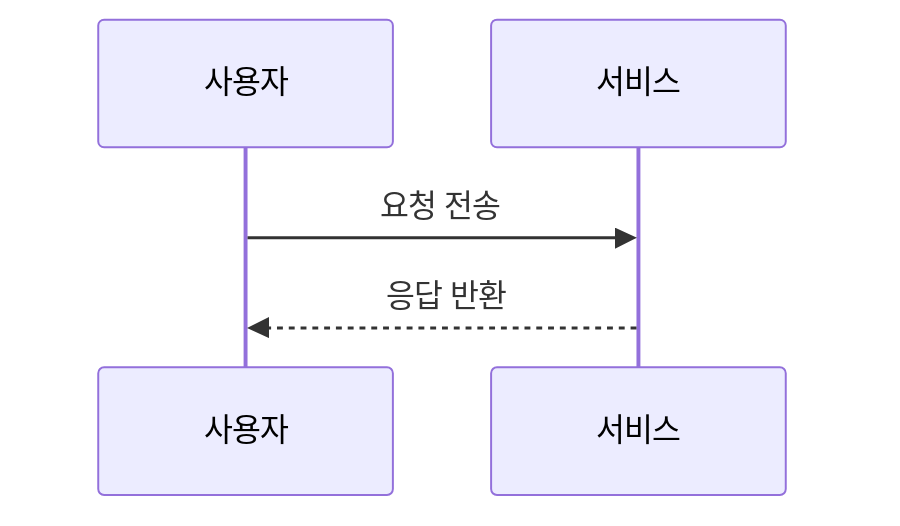

# Mermaid 보고서

## 처리 흐름

본문 **강조**와 `a * b`, \* 이스케이프를 보존합니다.



## 호출 순서



| 항목 | 값 |
| --- | ---: |
| 상태 | 완료 |

```js
const text = "**literal** & <tag> `code`";
// ~~~ must not close a backtick fence
```

````text
```nested
# literal heading * literal
```
````
